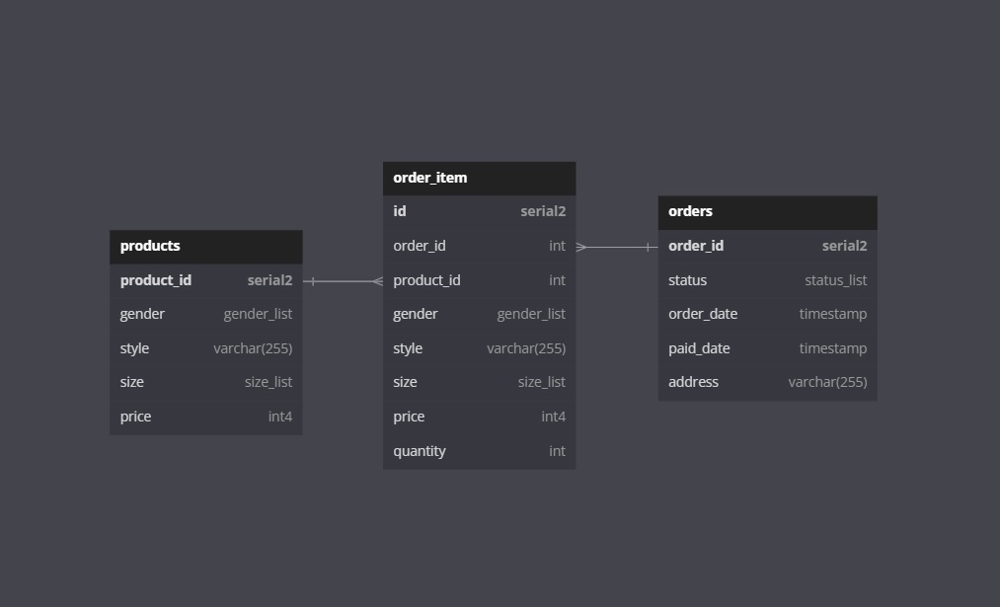

# ClothesShop-Practice-Fiber
<h3 align="center">🚨🚨🚨 This document is in progress 70% 🚨🚨🚨</h3>

<h3>Database schema</h3>

<p align="center">

<p>
<details><summary><h3>Getting started</h3></summary>
<p>
<ul>
<li>
 
<strong>Install</strong>
 
```
$ git clone https://github.com/santichoks/ClothesShop-Practice-Fiber.git
$ cd ClothesShop-Practice-Fiber
$ go get -u
```
</li>
 
<li>
 
<strong>Setting up your local environment</strong>
 
create an `.env` file in the application root directory.
 
```
FIBER_HOST=localhost
FIBER_PORT=3000
DB_HOST=localhost
DB_PORT=1150
DB_DATABASE=clothes_shop
DB_USERNAME=postgres
DB_PASSWORD=123456
DB_SSL_MODE=disable
```
</li>
 
</ul>
</p>
</details>

<details><summary><h3>API Endpoints</h3></summary>
<p>
<ul>
<li>

<p><strong>Get Products</strong></p>

|Endpoint|Method|Optional Params|Example|
|:-:|:-:|-|-|
|`/products`|GET|`gender [Men, Women]`|`http://localhost:3000/products?gender=Men`|
||||`http://localhost:3000/products?gender=Men&gender=Women`|
|||`size [XS, S, M, L, XL]`|`http://localhost:3000/products?size=L`|
||||`http://localhost:3000/products?size=L&size=XL`|
|||`style [Red, Black, Batman, Spiderman]`|`http://localhost:3000/products?style=Batman`|
||||`http://localhost:3000/products?style=Batman&style=Spiderman`|
|||`limit [amounts_per_page]`|`http://localhost:3000/products?limit=5`|
|||`page [page_number]`|`http://localhost:3000/products?page=1`|

<strong>Example :</strong> `http://localhost:3000/products?gender=Men&style=Batman&style=Spiderman&size=L&size=XL`

```
[
    {
        "product_id": 14,
        "gender": "Men",
        "style": "Batman",
        "size": "L",
        "price": 430
    },
    {
        "product_id": 15,
        "gender": "Men",
        "style": "Batman",
        "size": "XL",
        "price": 450
    },
    {
        "product_id": 24,
        "gender": "Men",
        "style": "Spiderman",
        "size": "L",
        "price": 430
    },
    {
        "product_id": 25,
        "gender": "Men",
        "style": "Spiderman",
        "size": "XL",
        "price": 450
    }
]
```

</li>

<li>

<strong>Get Orders</strong>

|Endpoint|Method|Optional Params|Example|
|:-:|:-:|-|-|
|`/orders`|GET|`start_date [yyyy-mm-dd]`|`http://localhost:3000/orders?start_date=2022-11-16&end_date=2022-11-30`|
|||`end_date [yyyy-mm-dd]`|`http://localhost:3000/orders?start_date=2022-11-16&end_date=2022-11-30`|
|||`status [placed_order, paid, shipping_out, completed]`|`http://localhost:3000/orders?status=shipping_out`|
||||`http://localhost:3000/orders?status=shipping_out&status=completed`|
|||`limit [amounts_per_page]`|`http://localhost:3000/orders?limit=5`|
|||`page [page_number]`|`http://localhost:3000/orders?page=1`|

<strong>Example :</strong> `http://localhost:3000/orders?start_date=2022-11-16&end_date=2022-11-30&status=shipping_out&status=completed`
 
```
[
    {
        "order_id": 3,
        "status": "shipping_out",
        "order_date": "2022-11-16T05:15:34.343Z",
        "paid_date": "2022-11-18T05:15:46.041Z",
        "address": "940 Lat Krabang"
    },
    {
        "order_id": 4,
        "status": "completed",
        "order_date": "2022-11-18T05:15:46.874Z",
        "paid_date": "2022-11-20T05:18:47.435Z",
        "address": "940 Lat Krabang"
    },
    {
        "order_id": 8,
        "status": "shipping_out",
        "order_date": "2022-11-26T05:20:32.128Z",
        "paid_date": "2022-11-28T05:21:46.05Z",
        "address": "940 Lat Krabang"
    },
    {
        "order_id": 9,
        "status": "completed",
        "order_date": "2022-11-28T05:21:46.359Z",
        "paid_date": "2022-11-30T05:21:55.679Z",
        "address": "940 Lat Krabang"
    }
]
```
</li>

<li>

<strong>Create Order</strong>

|Endpoint|Method|Optional Params|Example|
|:-:|:-:|:-:|-|
|`/orders`|POST|-|`http://localhost:3000/orders`|

<p><strong>JSON Body format</strong></p>

```
{
    "product_details": {
        "product_id":[6],
        "gender":["Women"],
        "style":["Black"],
        "size":["XS"],
        "price":[290],
        "quantity":[1]
    },
    "address":"12/9 Phaholyothin Sukhumvit Bangkok 10900"
}
```
<strong>Note :</strong> The same index of the array represents the same product detail.
```
{
    "product_details": {
        "product_id":[1, 2, 3],
        "gender":["Men", "Men", "Men"],
        "style":["Red", "Red", "Red"],
        "size":["XS", "S", "M"],
        "price":[400, 400, 420],
        "quantity":[1, 3, 5]
    },
    "address":"12/9 Phaholyothin Sukhumvit Bangkok 10900"
}
```

<strong>Example :</strong> `http://127.0.0.1:3000/orders`
 
```
{
    "status": "order has been created"
}
```
</li>
</ul>
</p>
</details>
<details><summary><h3>Install the Docker PostgreSQL Container</h3></summary>
<p>
<ul>
 
<li>

<strong>Pull image</strong>
<p><a href="https://hub.docker.com/_/postgres">PostgreSQL Docker Image</a></p>

```
$ docker pull postgres:alpine
```
</li>
 
<li>

<strong>Run the container</strong>

```
$ docker run --name PostgreSQL -e POSTGRES_PASSWORD=123456 -p 1150:5432 -d postgres:alpine
```
</li>
 
<li>

<strong>Create a database</strong>

```
$ docker exec -it PostgreSQL bash
```

```
$ psql -U postgres
```

```
$ CREATE DATABASE clothes_shop;
```
</li>
 
<li>

<strong>Check if the database has been created</strong>
 
```
$ \l
```
</li>

</ul>
</p>
</details>
